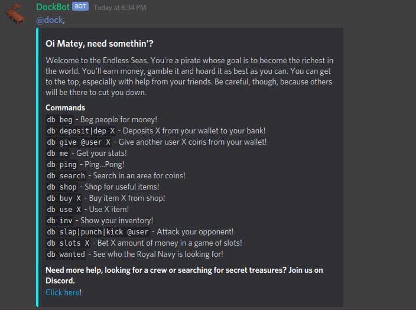
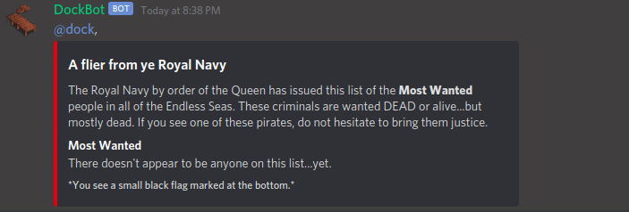
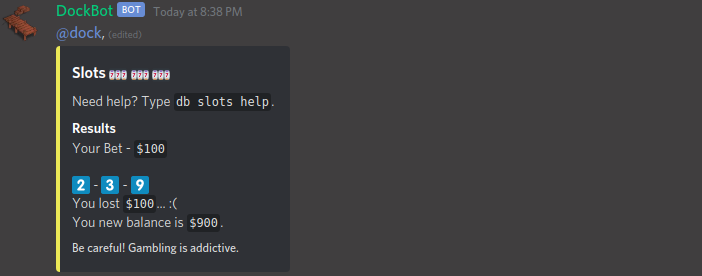

DockBot
===

A pirate-themed MMO for Discord.

*Don't worry, it's SFW!*


# What is DockBot?
DockBot gives users in your Discord server access to the Endless Seas, a watery realm with all the piratey goodness. DockBot was inspired by DankMemer but quickly turned into it's own unique bot with a boat-y twist. With DockBot, your users will sail the seas in search for treasure, gamble their earnings and face their opponents in epic text-based action. Just watch out for the Royal Navy!

### Featuring...

## A help menu


## A Most Wanted list


## Slots


## And much more...

# How to Play
Since DockBot is so early in development, it's only on my server. Get in touch with me if you'd like to give it a try on yours. For now, please join **Dock's Dev Dinghy** to play. There's dedicated channels to play and you can also DM DockBot if you want to be more private.

[](https://discord.gg/4TVQez4)

Once you're in, you can simply join `#dockbot-room-1` or `#dockbot-room-2` and start playing!

Need a walkthrough? Got ideas, tips, suggestions, feedback, bug finds? Feel free to get help or discuss anything concerning DockBot in `#dockbot`.

A good first command to run is `db help`. :)

# How to Contribute

### Found a bug or want to offer some feedback?

Please join our Discord server and let me know in `#dockbot` or you can skip all that by creating an issue in the GitHub tracker.

### Are you a coder?

Get in touch! If you have ideas or want to help implement mine, just reach out. I'm a friendly guy. You're also welcome to discuss whatever you're working on in `#community-projects`.

### Want to spread the word about the upcoming Discord Bot Savoir, DockBot?

I like that. I like you. Get in touch.

# Running DockBot

1. Install the latest version of Node, NPM, etc...
2. Clone the DockBot project
3. Create the .env

```
APP_DEBUG=true

DISCORD_ID=
DISCORD_SECRET=
DISCORD_BOT_TOKEN=
DISCORD_PERMS=67584
DISCORD_ME=db

DB_NAME=
DB_USER=
DB_PASS=

WAITTIME=1

SEARCH_CHANCE=80

BEG_CHANCE=70

```

4. Create your DB, then run `npx sequelize db:migrate`
5. Run it! `npx nodemon`


### Thanks for checking out the project. I look forward to seeing you on the Dinghy.
